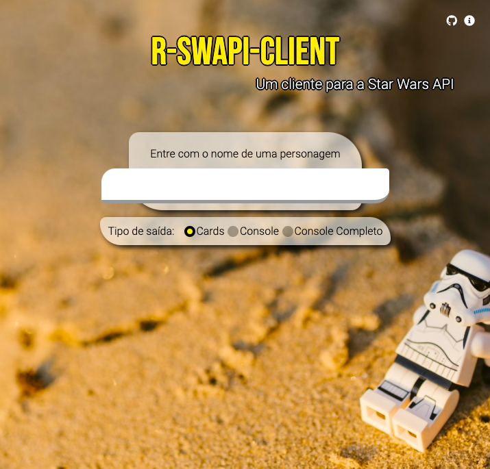
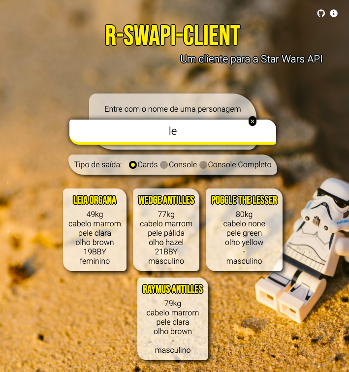

# r-swapi-client

## en
This application is Brazilian Portuguese only.

## pt-BR

Essa página funciona como cliente da Star Wars API.

Você pode procurar qualquer personagem dos filmes (que valem a pena) e
escolher a forma de visualização.

A aplicação tem as características:
- utiliza o fetch() api
- tradutor de termos em inglês (ainda não aplicado completamente)
- tem 3 formas de visualização dos dados
- links externos apenas para fontes (via CDN) e GitHub
- aplicação totalmente em Vanilla (HTML, CSS e JavaScript)

## Demos

